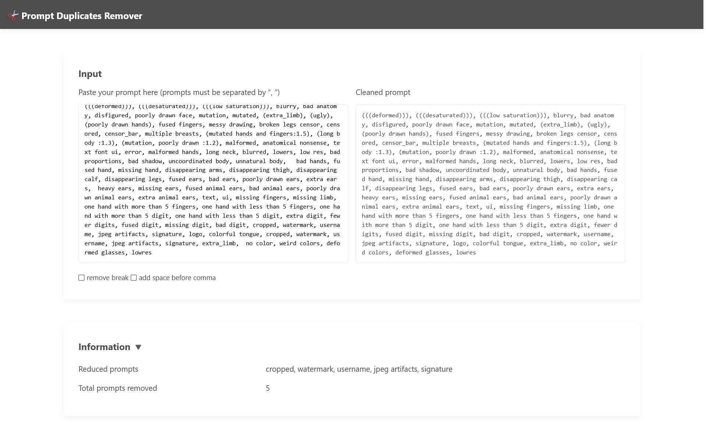

# Prompt Duplicates Remover

## What is this?

This tool supports you to engineer prompts for generating images with Stable Diffusion. This requires you to have both your Browser and a PHP-installed server.

## Live example

<https://tools.yokkin.com/prompts/>

## API

The API entrypoint lives in `/api/index.php`.
